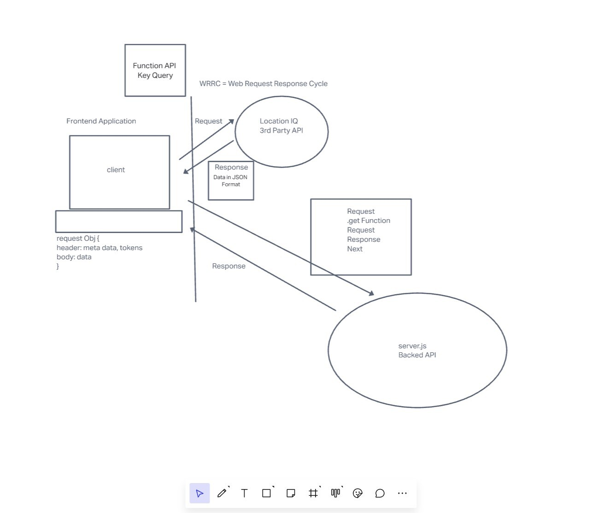

# city-explorer-api

**Author**: Tyler Huntley
**Version**: 1.0.0 (increment the patch/fix version number if you make more commits past your first submission)

## Overview

- Back-end server for our app to get and display city data
<!-- Provide a high level overview of what this application is and why you are building it, beyond the fact that it's an assignment for this class. (i.e. What's your problem domain?) -->

## Getting Started

<!-- What are the steps that a user must take in order to build this app on their own machine and get it running? -->

## Architecture

-JavaScript, express, cors, dotenv, nodemon
<!-- Provide a detailed description of the application design. What technologies (languages, libraries, etc) you're using, and any other relevant design information. -->

## Change Log

01-17-23 1430 - Initial server setup and push
<!-- Use this area to document the iterative changes made to your application as each feature is successfully implemented. Use time stamps. Here's an example:

01-01-2001 4:59pm - Application now has a fully-functional express server, with a GET route for the location resource. -->

## Credit and Collaborations

TAs, Audrey Patterson (instructor)
<!-- Give credit (and a link) to other people or resources that helped you build this application. -->

---------------------------------------------------------------

Name of feature: Backend setup

Estimate of time needed to complete: 3 hours

Start time: 1450

Finish time: 1800

Actual time needed to complete: ~3hrs

